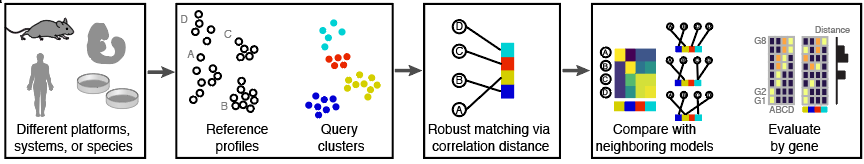

CellMatch is an `R` package for transparent staging of stem cell derivatives. 

##### Installation

To install from github:

    install.packages("devtools") #if you don't have devtools already
    devtools::install_github("maehrlab/cellmatch", build_vignettes = TRUE)
   

   
##### Use

For demonstrations of the package:

    browseVignettes("cellmatch")

One of the vignettes reproduces our staging of stem-cell derived pharyngeal foregut endoderm using an embryonic endodermal time-course. The other is a pancreas demo. It shows more of what CellMatch does under the hood, and it includes utility functions for gene-name conversion.

    
